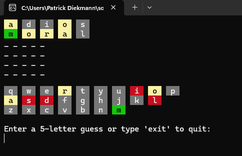

# Wordle
Visist https://www.nytimes.com/games/wordle/index.html to learn the simple rules of Wordle and see what this game tries to mimic.

The game is played via the console. A player can start the game in 2 different ways.

a) Type in a word and hit enter. The word must be 5 characters long.

b) Hit enter and a random world will be selected from a word list (english)

Only letters from a-Z are accepted.

The top left represents your guesses.

The 3 bottom rows represents the keyboard and the chars you already tried.